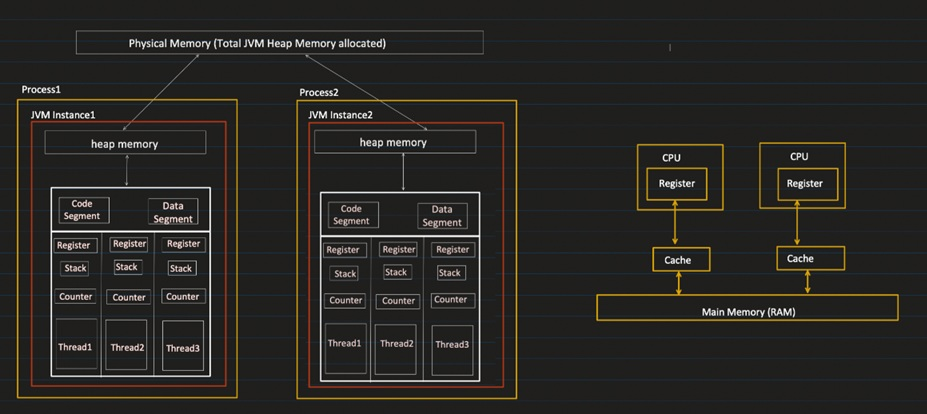

---

# 🧠 **Process & Threads in Java – Complete Notes**


---




---

## 🔹 1. **Program Execution Flow in Java**

When you run:

```
javac Main.java   → Bytecode (.class)
java Main         → Execution starts
```

### Execution Steps:

1. **OS creates a Process**
2. **JVM instance is created for that process**
3. JVM allocates memory areas:

   * Heap
   * Stack
   * Code Segment
   * Data Segment
   * Registers
   * Program Counter (PC)

👉 **Each process = Separate JVM instance**

---

## 🔹 2. **JVM Memory Areas**

| Memory Area              | Shared?                | Stores                         |
| ------------------------ | ---------------------- | ------------------------------ |
| **Code Segment**         | ✅ Shared among threads | Compiled machine code          |
| **Data Segment**         | ✅ Shared among threads | Static & global variables      |
| **Heap**                 | ✅ Shared among threads | Objects (created with `new`)   |
| **Stack**                | ❌ Per Thread           | Method calls, local variables  |
| **Register**             | ❌ Per Thread           | Intermediate execution data    |
| **Program Counter (PC)** | ❌ Per Thread           | Address of current instruction |

---

## 🔹 3. **Heap Size Allocation**

Each JVM instance gets its own heap:

```bash
java -Xms256m -Xmx2g Main
```

| Option | Meaning           |
| ------ | ----------------- |
| `-Xms` | Initial heap size |
| `-Xmx` | Maximum heap size |

⚠ Even if system JVM heap is large, **each process can only use what you assign**.

---

## 🔹 4. **Threads Inside a Process**

A process can have multiple threads:

```
Process (JVM Instance)
   ├── Thread 1
   ├── Thread 2
   └── Thread 3
```

### Threads SHARE:

* Heap
* Code Segment
* Data Segment

### Threads DO NOT SHARE:

* Stack
* Register
* Program Counter

---

## 🔹 5. **Code Segment**

* Stores **machine code**
* Generated from bytecode using:

  * Interpreter OR
  * JIT Compiler
* **Read-only**

---

## 🔹 6. **Data Segment**

Stores:

* Static variables
* Global variables

⚠ Since shared → **Synchronization needed**

---

## 🔹 7. **Heap Memory**

* Objects live here
* Shared among threads
* Managed by Garbage Collector
* Needs synchronization

---

## 🔹 8. **Stack (Per Thread)**

Stores:

* Method calls
* Local variables
* Function execution data

Each thread has its own stack → no conflict

---

## 🔹 9. **Register (Per Thread)**

Used for:

* Intermediate values
* CPU calculations
* Context switching support

---

## 🔹 10. **Program Counter (PC)**

* Points to the **next instruction** in code segment
* Each thread has its own PC
* Helps resume execution after context switch

---

# 🔄 11. **Context Switching**

When only **1 CPU core** exists:

1. Thread runs for time slice
2. OS saves its:

   * Register
   * PC
3. Another thread runs
4. Later first thread resumes from saved state

👉 Looks parallel, but actually time-sharing

---

## 🧩 Single Core vs Multi Core

| CPU Cores      | Execution Type                      |
| -------------- | ----------------------------------- |
| 1 Core         | Context Switching (Pseudo-parallel) |
| Multiple Cores | True Parallel Execution             |

---

# 🧵 12. **Multithreading Definition**

> Ability of a program to run multiple threads **within the same process** sharing memory.

---

## ✅ Benefits of Multithreading

| Benefit          | Explanation             |
| ---------------- | ----------------------- |
| Performance      | Parallel task execution |
| Responsiveness   | Faster UI / system      |
| Resource Sharing | Memory efficient        |

---

## ❌ Challenges

| Issue                    | Why                               |
| ------------------------ | --------------------------------- |
| Race Condition           | Multiple threads modify same data |
| Deadlock                 | Threads waiting forever           |
| Debugging Hard           | Non-deterministic behavior        |
| Synchronization Overhead | Slows performance                 |

---

# 🔁 13. **Multitasking vs Multithreading**

| Feature        | Multitasking     | Multithreading                |
| -------------- | ---------------- | ----------------------------- |
| Unit           | Process          | Thread                        |
| Memory Sharing | ❌ No             | ✅ Yes                         |
| JVM Instance   | Separate         | Same                          |
| Isolation      | High             | Low                           |
| Example        | Chrome + VS Code | Multiple tasks inside browser |

---

## 🎯 Final Concept Summary

```
Program → Process → JVM Instance
JVM → Heap + Code + Data + Threads
Thread → Stack + Register + PC
CPU → Executes machine code using PC
OS → Schedules threads
```

---
