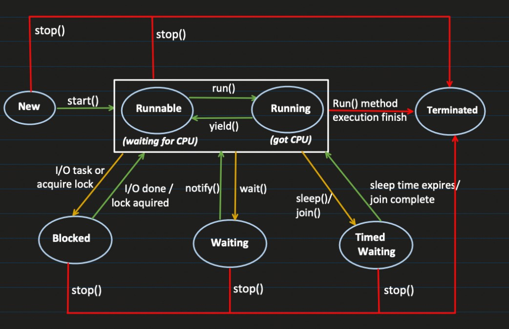

---

# 🧵 Java Thread Life Cycle

A thread in Java goes through **different states** from creation to completion.

---



---

## 🟢 1. **NEW State**

**How it comes here:**

```java
Thread t = new Thread();
```

**Meaning:**

* Thread object is created
* It is **just an object in memory**
* Thread has **not started yet**
* No CPU allocation

**Next move:**
➡️ `t.start()` → goes to **Runnable**

---

## 🟡 2. **RUNNABLE State** (Includes “Running”)

> Java officially treats **Runnable + Running as one state**

**How it comes here:**

```java
t.start();
```

**Meaning:**

* Thread is ready to run
* Waiting for **CPU time**
* When CPU gives time → it executes (`run()` method)
* After context switch → goes back to waiting in runnable queue

🧠 Think:

* **Runnable = waiting for CPU**
* **Running = got CPU**
* But both are considered **RUNNABLE**

**From here thread can:**

* Finish → **Terminated**
* Need I/O → **Blocked**
* Call `wait()` → **Waiting**
* Call `sleep()` / `join()` → **Timed Waiting**

---

## 🔵 3. **BLOCKED State**

Thread is waiting to **acquire a monitor lock**.

**Causes:**

1. 🔐 Trying to enter a `synchronized` block but lock is held by another thread
2. ⏳ Some I/O-related blocking (conceptual understanding)

**Important Point:**
✅ **Releases monitor lock? → YES**

**Returns to:**
➡️ Runnable when lock is acquired

---

## 🟣 4. **WAITING State**

Thread waits **indefinitely** until another thread wakes it up.

**How it comes here:**

```java
obj.wait();
```

**How it wakes up:**

```java
obj.notify();
obj.notifyAll();
```

**Meaning:**

* Thread is paused
* Won’t run until someone notifies

**Important:**
✅ **Releases monitor lock**
Thread gives up the lock and waits.

**Returns to:**
➡️ Runnable after `notify()` / `notifyAll()`

---

## 🟠 5. **TIMED WAITING State**

Thread waits for a **specific time**.

**How it comes here:**

```java
Thread.sleep(5000);
t.join(3000);
obj.wait(2000);
```

**Meaning:**

* Thread pauses for fixed time
* Automatically becomes runnable after time ends

**Important:**
❌ **Does NOT release monitor lock** (for `sleep()`)
(Unlike `wait()`)

**Returns to:**
➡️ Runnable after time expires or condition met

---

## 🔴 6. **TERMINATED State**

Thread has finished execution.

**How it comes here:**

* `run()` method completes
* Exception ends thread

**Important:**
❌ Thread **cannot be restarted**

```java
t.start(); // ❌ IllegalThreadStateException
```

---

# 🔁 State Flow Summary

```
NEW --start()--> RUNNABLE --CPU--> RUNNING
  |                                |
  |                                v
  |                          run() finishes
  |                                |
  v                                v
TERMINATED <-----------------------
```

From **Runnable/Running**:

| Action     | Goes To       |
| ---------- | ------------- |
| Needs lock | Blocked       |
| `wait()`   | Waiting       |
| `sleep()`  | Timed Waiting |
| `join()`   | Timed Waiting |

---

# 🔐 Monitor Lock Behavior (Very Important)

| State                       | Releases Monitor Lock?            |
| --------------------------- | --------------------------------- |
| **Blocked**                 | ✅ Yes                             |
| **Waiting (wait())**        | ✅ Yes                             |
| **Timed Waiting (sleep())** | ❌ No                              |
| **Runnable**                | Holds lock if inside synchronized |

---

# 🎯 Key Interview Points

* `start()` → creates **new thread**, calls `run()` internally
* Calling `run()` directly = **normal method**, no new thread
* `wait()` → releases lock
* `sleep()` → **does NOT release lock**
* Thread once terminated → **cannot restart**

---
